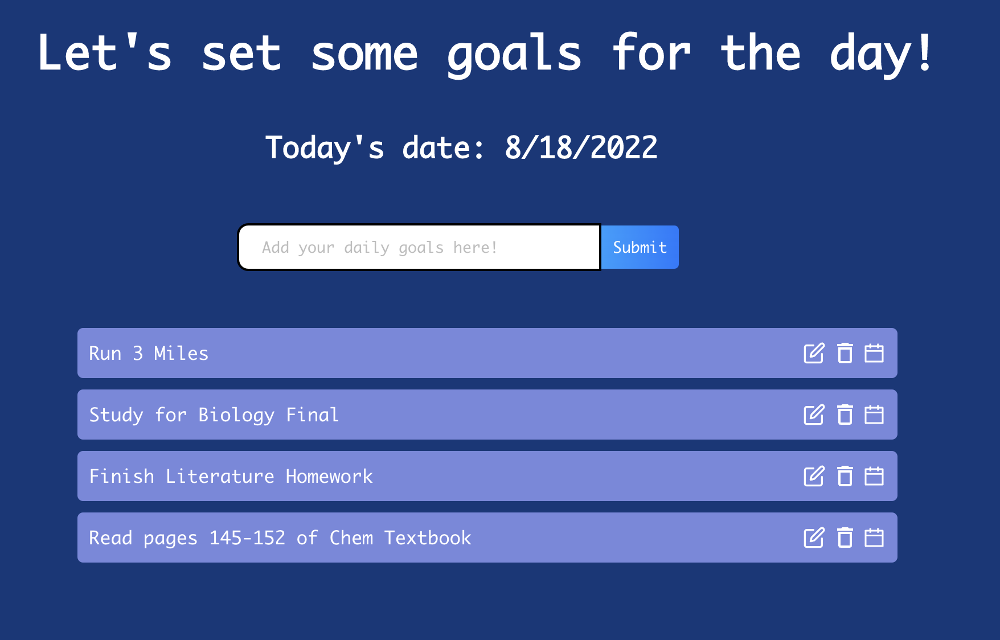

##### *In this section, I'll be giving a quick overview of a couple of projects that I've worked on over the past few years* 

I've been interested in computer science for most of my life. What started off as simple Scratch projects became more advanced games and websites as I've learned more about the applications of CS. 

These are the programming languages which I am **proficient** in: C/C++, Python, Java, HTML/CSS, JavaScript

and these are the languages which I am **familiar** with but not completely proficient in: 
R, ReactJS 

Listen below are some of my favorite projects that I've worked on. Click on any of the links listed below to directly jump down to the project or scroll down to explore all my projects:

## Project List 
- [Bingo: Improving Accessibility on E-Commerce Websites](#bingo)
- [Stock Market Simulator](#stock)
- [Image Resize](#image)
- [Productivity Planner](#planner)
- [Sudoku Solver](#sudoku)
- [Plagiarism Checker](#plagiarism)
- [Understanding Prisoner's Dilemma](#linal)
- [Research: Comparing the Effects of Education Spending with Income Inequality](#econometrics)

  
### Bingo: Improving Accessibility on E-Commerce Websites *(JavaScript)* 

### Stock Market Simulator *(C++)* 

C++ is the programming language I am most proficient and comfortable with so I had a lot of fun creating this stock market simulator earlier this year. The program focuses on constructing an online stock market simulation that determines what are the optimal times to buy or sell multiple different stocks to maximize profit. Based on a running list of orders placed for stocks in a market, the program evaluates at what moment the player should place sell or buy orders for a particular stock and provides additional information about the stock, traders, and median price. My personal favorite part of the project was creating a "time-travel" mode using heaps/priority queues. This mode looks at the entire list of orders to find the best theoretical times that trades should be completed to generate the largest possible profit. 

### Image Resize *(C++)* 

Another one of my favorite projects with C++ was creating an image resize program that applies the [seam-carving algorithm](https://www.analyticsvidhya.com/blog/2020/09/seam-carving-algorithm-a-seemingly-impossible-way-to-resize-an-image/) to assist in content-aware image resizement while also preserving picture quality. The seam-carving algorithm is crucial for this project because it resizes images without distorting them. The program works by creating an energy matrix that includes the energy of each pixel in the image and a vertical cost matrix that is used to identify the pixels with lower costs that will later be removed. Then, the program scales by both length and width to remove the seams of minimal cost pixels and successfully resize the image. The final program allows users to input any image and the program will minimize or enlarge the image while avoiding alterations to the image quality.

### Productivity Planner *(ReactJS)* 

Over the past summer, I worked on creating a productivity planner that helps users keep track of their daily goals. The application was constructed with ReactJS and was my first introduction to React Hooks, which I used to change the state of different objects. This website allows users to input different goals that they wish to complete, and then adds them to a to-do list. Users are provided with the option to modify, complete, and delete tasks with a beta feature that allows the tasks to be added to their Google Calendar. 

As seen in this picture of the application, the program displays today's date, the goals for the day, and which goals have been completed with edit options.

The code for this application can be found [here](https://github.com/ronithgan/ProductivityPlanner).

### Sudoku Solver *(Python)* 

One of my first projects after learning Python was a sudoku solver that utilizes the backtracking algorithm. The project starts off by accepting input from the user and determining if the user's input creates a valid sudoku board. If the board is valid, the program then loops through the board, finds an empty space, and calculates which value is valid at that index. If a value can be set, the program moves on to the next index, else, the board "reverts" to change the value of the previous "empty" space so that the board can be valid, making this a backtracking algorithm. This makes the program significantly faster than a "brute-force" method that would manually check if each value is valid at every single index. Once the algorithm is complete, the program outputs a complete sudoku board to the user.

The code for this program can be found [here](https://github.com/ronithgan/SudokuSolver).

### Plagiarism Checker *(Java)* 

Another one of my favorite CS projects was a plagiarism checker that I created for my Advanced Java and Machine Learning class. The goal of this project was to use the cosine similarity algorithm to calculate the document distance between two texts and evaluate if there is plagiarism present.

The document distance is calculated by analyzing the frequency of all the words in each document and then comparing these values with the frequency of values in another document, with the cosine similarity algorithm measuring the angle between word frequency vectors. I also implemented a scanner that removes common-used words and punctuation to improve the accuracy of the application. The program then prints if the document is a near copy, require light revision or heavy revision, or if there is no plagiarism.

[Here](https://docs.google.com/document/d/1JBMZ0zBstOnw2dwDTyu1K7rgoM4X6Nv5i5L9oHhuKgA/edit?usp=sharing) is a link to a short write-up I did that explains the project in further detail.

### Understanding Prisoner's Dilemma *(Octave)* 

My first exposure to Octave was when I was in my linear algebra class during junior year. We were asked to create small applications and models to demonstrate different topics we were interested in and since I was fascinated by Game Theory, I wanted to model the Prisoner's Dilemma situation. I modeled the situation as a two-player game with two-dimensional matrices to represent the various choices players can make. I demonstrated the fundamental theorem of zero-sum games which shows the optimal strategy for each player and the value of the game. 

My final result was an interactive model that allowed users to play against the computer. After the interaction is complete, the computer then explains the Dilemma by showing the optimal strategies for both the player and computer and the saddle-point (the point both players minimize losses). This simple application connected my two favorite subjects: game theory and computer science.

### Research: Comparing the Effects of Education Spending with Income Inequality *(R)* 

For my econometrics class in senior year, I decided to study whether or not increasing education spending and having higher school enrollment rates can combat the problem of rising income inequality. I predicted that this would be the case and countries that invest more in education will have lower levels of income inequality.

My predictor variables for the experiment were used to measure education level per country so I chose: government expenditures on education as a % of GDP and the average net enrollment rates for primary school students. For my response variable, I had to measure income inequality and so I used the Gini index: a coefficient that measures the level of wealth inequality within a country from 0 to 100. I also used GDP as an instrumental variable because it has a strong correlation with education expenditures. GDP can be used to measure the economic conditions in a country over time and will usually affect education expenditures because if a country is experiencing a recession and their GDP falls, they will likely allocate less money towards education and more towards other priorities like economic relief. 

I also tested for various robustness tests to look for homoscedasticity, normal residuals, no autocorrelation, linearity, zero conditional mean, and the Wu-Hausman test. The robustness tests and p-value revealed that the model passed all of our assumptions.

As a result of this model, I discovered that my hypothesis was correct and conclude that there is a significant correlation between the education expenditures and income inequality. From this analysis, we can conclude that the % of GDP that a country spends on education is an important factor in reducing income inequality as countries that spent more on education had a lower Gini index which means there is more income equality. This means that in order to curb inequality, countries should focus on spending a greater amount on education funding.

Here's the data from the experiment: 

Click [here](https://docs.google.com/document/d/133ZyLg-5mtxDCEb1ZyUrMotajZ8LEH9vqcN7NF-hNgM/edit?usp=sharing) to read my entire research paper or here for the [slides](https://docs.google.com/presentation/d/1UG7hoJBA9HGMhtR8l37qlz0wCWLZz2lvYpNXcmxhOYE/edit?usp=sharing) used in my presentation.
  
[Jump back to the top of the page](#top)

